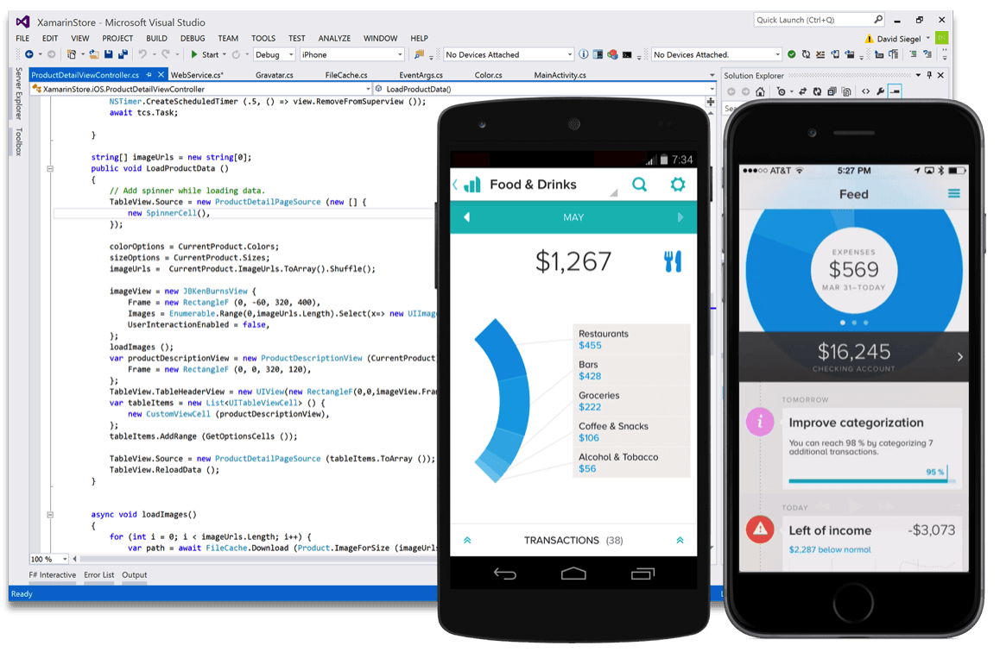

# Consumindo uma API REST Web Services Através de um Mobile App Xamarin

Tutorial demonstrando como consumir uma **API REST Web Services** através de um aplicativo cliente mobile desenvolvido com **Xamarin**.

## REST Web Services

**REST (Representational State Transfer)** é um modelo de arquitetura especificado para construção de web services. Solicitações REST são processadas através do protocolo HTTP utilizando seus métodos, onde cada um possui uma finalidade, conforme definido abaixo:

Neste tutorial, veremos como **consumir uma API REST** através de uma aplicação cliente mobile desevolvida com **Xamarin Forms**. Para conhecer mais sobre o **modelo de arquitetura REST**, veja o tutorial: [RESTful Web Services com ASP.NET Core](https://github.com/robertocampello/RESTful_Web_Services_com_ASP.NET_Core).

## Introdução ao Xamarin Cross-Plataform

O **[Xamarin](https://docs.microsoft.com/en-us/xamarin/)** é uma tecnologia cross-plataform voltada para o desenvolvimento aplicativos mobile nativos para as plataformas **Android**, **iOS** e **Windows**. É uma tecnologia moderna e sofisticada com características como:

* Rich Editor que permite a criação de interfaces ricas para **iOS**, **Android** e **Windows**;
* Plataforma nativa integrada com o **iOS** e **Android**;
* Linguagens familiares como **C#**, **[XAML](https://docs.microsoft.com/en-us/dotnet/framework/wpf/advanced/xaml-overview-wpf)**, e **CSS**;
* Frameworks UI flexíveis para desenvolvimento **Nativo**, **Cross (Xamarin.Forms)** ou **ambos**;
* Integração com o **Visual Studio 2017** (versão **Windows** ou **Mac**).

Neste tutorial **não iremos nos aprofudar** no desenvolvimento de aplicativos mobile usando a **tecnologia Xamarin**, demonstraremos apenas como criar uma **simples aplicação mobile cliente usando [Xamarin.Forms](https://docs.microsoft.com/en-us/xamarin/xamarin-forms/) para consumir uma API REST Web Services**. Caso, você deseje conhecer com mais detalhes a tecnologia não deixe de ver o tutorial: [Desenvolvendo Mobile Apps com Xamain]().

[Xamarin.Forms](https://docs.microsoft.com/en-us/xamarin/xamarin-forms/) é uma ferramenta **cross-plataform** que permite que desenvolvedores possam criar de forma eficiente **interfaces nativas** que podem ser compartilhadas de forma cross entre as plataformas **iOS**, **Android** e **Windows**.

***Observação***: Além da tecnologia **Xamarin.Forms**, a ferramenta Xamarin possue também as tecnologias **[Xamarin.Adroid](https://docs.microsoft.com/en-us/xamarin/android/)** e **[Xamarin.iOS](https://docs.microsoft.com/en-us/xamarin/ios/)** que permitem o desenvolvimento utilizando de **forma completa todas as funcionalidades da SDK**. 
